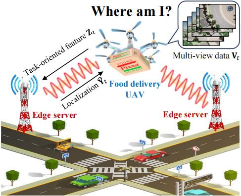
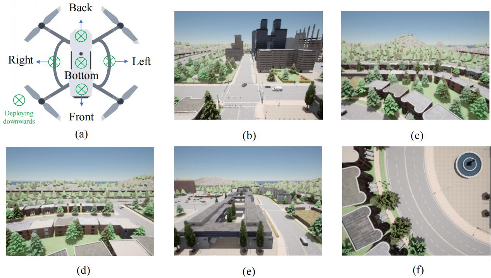
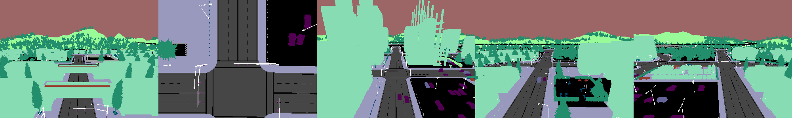
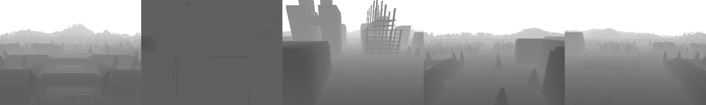
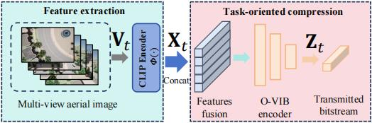
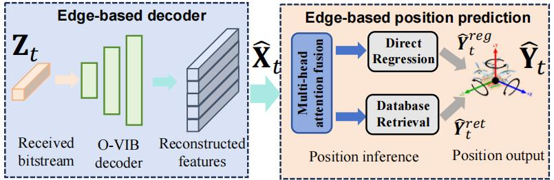
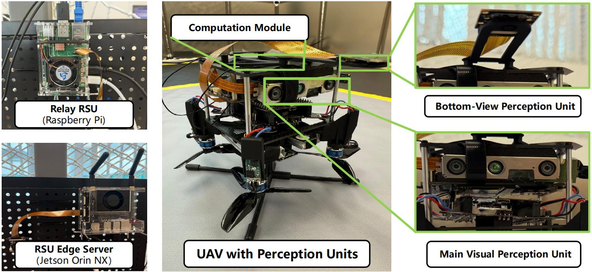

# Task-Oriented Communications for Visual Navigation with Edge-Aerial Collaboration

The repository for paper 'Task-Oriented Communications for Visual Navigation with Edge-Aerial Collaboration in Low Altitude Economy'.

## Abstract
To support the Low Altitude Economy (LAE), it is essential to achieve precise localization of unmanned aerial vehicles (UAVs) in urban areas where global positioning system (GPS) signals are unavailable. Vision-based methods offer a viable alternative but face severe bandwidth, memory and processing constraints on lightweight UAVs.

Inspired by mammalian spatial cognition, we propose a task-oriented communication framework, where UAVs equipped with multi-camera systems extract compact multi-view features and offload localization tasks to edge servers. We introduce the **O**rthogonally-constrained **V**ariational **I**nformation **B**ottleneck encoder (O-VIB), which incorporates automatic relevance determination (ARD) to prune non-informative features while enforcing orthogonality to minimize redundancy. This enables efficient and accurate localization with minimal transmission cost.

Extensive evaluation on a dedicated LAE UAV dataset shows that O-VIB achieves high-precision localization under stringent bandwidth budgets.

## Repository Layout

1. **`carla_multi_view/` – CARLA-based multi-view data collector**  
   Connects to CARLA in synchronous mode, spawns five rigidly mounted sensors (RGB, depth, semantic) on the UAV chassis, follows road-aligned waypoints, and writes aligned multi-view frames plus metadata to disk.

2. **`edge_database_encoder/` – Edge-side feature database builder**  
   Uses CLIP to encode the collected RGB frames, stores per-view descriptors, and aggregates averaged embeddings inside a FAISS index with coordinate supervision.

3. **`uav_lightweight_encoder/` – Lightweight VIB encoder for UAV transmission**  
   Contains the single-view and multi-view VIB models, training helpers, and CLI tools to compress the multi-view feature tensors into compact latent codes before uplink.

4. **`edge_localization/` – Edge-side localization and inference**  
   Trains the attention-based multi-view fusion model, runs online position inference, and optionally combines direct regression with FAISS retrieval candidates.

The public repository keeps source code and documentation only. Datasets, trained checkpoints, feature databases, logs, and experiment outputs are intentionally excluded for size and privacy reasons.

### 1. CARLA Multi-View Data Collector

```
python -m carla_multi_view.collector
```

Tune `CollectorSettings` inside `carla_multi_view/collector.py` to change the CARLA map, altitude, sampling distance, or output root. The collector:

- configures the CARLA world in synchronous mode and keeps the traffic manager aligned,
- spawns five cameras with RGB/depth/semantic modalities and keeps them rigidly attached to the UAV body,
- samples road-following waypoints via `RoadWaypointPlanner`,
- saves RGB PNGs, depth `.npy` + log-depth PNGs, semantic PNGs, and frame-level metadata JSON files under the configured dataset directory.

### 2. Edge-Side Visual Database Encoding

```
python -m edge_database_encoder.build_database \
  --dataset_path /path/to/collected_dataset \
  --output_path /path/to/database_output \
  --model_name "ViT-B/32" \
  --device cuda
```

The script loads RGB frames plus metadata, extracts CLIP features view-by-view, stores them in `view_features/<camera>/<frame>.npz`, and creates a FAISS index alongside dataset statistics for downstream localization. Use `validate_database` to sanity-check the exported index.

### 3. Edge-Side Localization Model Training

```
python -m edge_localization.train_fusion \
  --feature_dir /path/to/database_output \
  --model_save_path outputs/edge_fusion/best_fusion.pt \
  --database_output_path outputs/edge_fusion/trainval_database \
  --test_split_output outputs/edge_fusion/test_split \
  --device cuda
```

The training script reads `view_features/<camera>/<frame>.npz` files generated by `edge_database_encoder.build_database`. It trains a multi-view attention fusion network for 3D position regression and can also export a train/validation FAISS retrieval database. Legacy `.npy` feature dictionaries from earlier experiments are supported for migration, but the documented format is `.npz`.

### 4. UAV-Side Lightweight Encoder

**Training**

```
python -m uav_lightweight_encoder.train_vib \
  --feature_dir /path/to/database_output \
  --output ovib_multiview.pt \
  --mode multi \
  --latent_dim 64 \
  --hidden_dims 512 256 \
  --epochs 50 \
  --batch_size 128
```

**Compression**

```
python -m uav_lightweight_encoder.compress \
  --feature_dir /path/to/database_output \
  --weights ovib_multiview.pt \
  --output /path/to/latent_codes
```

The training CLI covers both single-view and multi-view VIB models, while `compress.py` loads a trained checkpoint and exports per-frame latent codes ready for transmission.

### 5. Edge-Side Online Localization

```
python -m edge_localization.online_localization \
  --model_path outputs/edge_fusion/best_fusion.pt \
  --test_data_path outputs/edge_fusion/test_split \
  --database_path outputs/edge_fusion/trainval_database \
  --output_path outputs/edge_fusion/evaluation \
  --top_k 3 \
  --device cuda
```

The inference script loads synchronized multi-view feature files, predicts the UAV position with the trained fusion model, and optionally appends FAISS retrieval candidates from the geo-tagged feature database. It writes `summary.json` and `full_results.json` when `--output_path` is provided. BEV visualization is optional and requires both `--bev_image_path` and `--bev_coords_path`; no local absolute paths are hard-coded.

## End-to-End Pipeline

1. Collect multi-view CARLA data with `carla_multi_view.collector`.
2. Build CLIP view features and a geo-tagged FAISS database with `edge_database_encoder.build_database`.
3. Train the edge-side attention fusion localizer with `edge_localization.train_fusion`.
4. Train and run the UAV-side VIB encoder with `uav_lightweight_encoder.train_vib` and `uav_lightweight_encoder.compress`.
5. Run edge-side online localization and evaluation with `edge_localization.online_localization`.

## System Model



Our system operates in a UAV-edge collaborative framework designed for GPS-denied urban environments. The model consists of:

- **Multi-camera UAV System**: Captures multi-directional views (Front, Back, Left, Right, Down) for comprehensive spatial awareness
- **Edge Server Infrastructure**: Maintains a geo-tagged feature database, enabling efficient localization
- **Communication-Efficient Design**: Optimizes the trade-off between localization accuracy and bandwidth consumption

The UAV captures multi-view images at each time step, extracts high-dimensional features through a feature extractor, and transmits compressed representations to edge servers. Our objective is to minimize localization error while keeping communication costs below a specified threshold.

## Multi-View UAV Dataset



We collected a comprehensive dataset using the CARLA simulator to facilitate research on multi-view UAV visual navigation in GPS-denied environments:

### Dataset Specifications:
- **Environments**: 8 representative urban maps in CARLA
- **Collection Method**: UAV flying at constant height following road-aligned waypoints with random direction changes
- **Camera Configuration**: 5 onboard cameras capturing different angles and directions
- **Image Types**: RGB, semantic, and depth images at 400×300 pixel resolution
- **Scale**: 357,690 multi-view frames with precise localization and rotation labels
- **Hardware**: Collected using 4×RTX 5000 Ada GPUs

### Dataset Visualization:

#### RGB Camera View


#### Semantic Segmentation View


#### Depth Map View


The dataset provides a realistic simulation of UAV flight in urban environments where GPS signals might be compromised or unavailable.

## Feature Extraction (UAV-side)



Our feature extraction pipeline is designed for robust multi-view feature extraction under limited bandwidth:

### Key Components:
- **CLIP-based Vision Backbone**: Utilizes CLIP Vision Transformer (ViT-B/32) pretrained on large-scale natural image-text pairs
- **Feature Processing**: Each image undergoes preprocessing (resize, normalize, tokenize) before feature extraction
- **Normalization**: Features are normalized to lie on the unit hypersphere, improving numerical stability and facilitating cosine similarity-based retrieval
- **Multi-view Feature Tensor**: Final representation constructed by concatenating view-wise embeddings, capturing a rich panoramic representation of the UAV's surroundings

This pipeline creates a memory base for the visual navigation system, enabling efficient localization with minimal communication overhead.

## Position Prediction (Edge Server-side)



The edge server receives compressed representations from the UAV and estimates the UAV's position using a sophisticated multi-view attention fusion mechanism:

### Position Inference:
- **Multi-view Attention Fusion**: Integrates information from multiple camera views
- **Hybrid Estimation Method**: Combines direct regression and retrieval-based inference
- **Adaptive Weighting**: Balances regression and retrieval estimates based on confidence scores
- **Geo-tagged Database**: Utilized for querying position information

This end-to-end pipeline optimizes the trade-off between localization accuracy and communication efficiency, enabling precise UAV navigation in GPS-denied environments with constrained wireless bandwidth.

## Hardware Implementation



We validated our approach using a physical testbed with real hardware components:

### Hardware Configuration:
- **UAV Compute**: Jetson Orin NX 8GB for encoding five camera streams
- **Communication**: IEEE 802.11 wireless transmission to nearby roadside units (RSUs)
- **Relay RSU**: Raspberry Pi 5 16GB that forwards data via Gigabit Ethernet to cloud edge servers when overloaded
- **Edge RSU**: Jetson Orin NX Super 16GB performing on-board inference

This hardware implementation allowed us to evaluate algorithm encoding/decoding complexity and latency in real-world conditions, confirming that our O-VIB framework delivers high-precision localization with minimal bandwidth usage.

### Position Prediction Demonstration:


The green dot represents the Ground Truth (GT), which is the actual coordinate of the UAV. The red dot represents the Top 1 prediction (Pred), which is the most accurate prediction. However, Top 2 and Top 3 are alternative prediction locations provided by the algorithm, but their accuracy is usually much lower than the Top 1 prediction.

## GitHub Issue Response

The edge-side localization and inference module is included in this repository update. It provides attention-fusion model training, online localization, optional FAISS retrieval, and evaluation scripts. Datasets, trained checkpoints, generated feature databases, and experiment outputs are not included because of file size and privacy constraints.

## Paper

Our research is detailed in the paper: [Task-Oriented Communications for Visual Navigation with Edge-Aerial Collaboration in Low Altitude Economy](https://www.researchgate.net/publication/391159895_Task-Oriented_Communications_for_Visual_Navigation_with_Edge-Aerial_Collaboration_in_Low_Altitude_Economy)


## License

This project is licensed under the MIT License - see the LICENSE file for details.

## Acknowledgments

This work of Y. Fang was supported in part by the Hong Kong SAR Government under the Global STEM Professorship and Research Talent Hub,  the Hong Kong Jockey Club under the Hong Kong JC STEM Lab of Smart City (Ref.: 2023-0108). This work of J. Wang was partly supported by the National Natural Science Foundation of China under Grant No. 62222101 and No. U24A20213, partly supported by the Beijing Natural Science Foundation under Grant No. L232043 and No. L222039, partly supported by the Natural Science Foundation of Zhejiang Province under Grant No. LMS25F010007. The work of S. Hu was supported in part by the Hong Kong Innovation and Technology Commission under InnoHK Project CIMDA. The work of Y. Deng was supported in part by the National Natural Science Foundation of China under Grant No. 62301300. 

## Contact

For any questions or discussions, please open an issue or contact us at zhefang4-c [AT] my [DOT] cityu [DOT] edu [DOT] hk.
